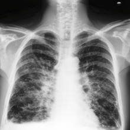
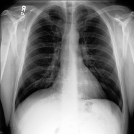

# Counterfactual Chest X-Ray Generation via Disentangled Anatomy and Diffusion Transformers (SiT)

This repository provides the official PyTorch implementation for generating counterfactual disease trajectories (progression and regression) in Chest X-rays. By explicitly disentangling stable anatomical structures from transient pathological features using anatomy encoder with Swin-T backbone, my framework simulates realistic continuous manipulation of pulmonary and cardiovascular pathologies and preserving patient anatomy.

## Overview

<div align="center">
  
  
</div>
<div align="center">
  <b>Disease Regression</b> (Sick → Healthy) &nbsp;&nbsp;&nbsp; <b>Disease Progression</b> (Healthy → Sick)
</div>

Generative modeling in medical imaging often struggles with identity preservation during image translation. This repository solves this by pairing Anatomy Encoder with [Scalable Interpolation Transformer (SiT)](https://github.com/willisma/sit). 

The model provides:
* Continuous severity dials: Interpolate disease severity smoothly from 0.0 (Healthy) to 1.0 (Severe Pathology).
* Counterfactual Regression/Progression of pathology: Simulatation of specific patient's condition would look if their state worsened or improved.
* Preservation of patient's identity: Retention of unique patient rib cages, lung shape and volume, and clavicles using orthogonal spatial latents.

## Methodology

1. Disentangled Anatomy Encoder:
I designed a custom segmentation head and an adversarial pathology probe to force the encoder to learn only structural anatomy. The resulting latent vector is orthogonal to disease presence.

2. SiT Diffusion Wrapper:
A Diffusion Transformer [(SiT-XL/2)](https://github.com/willisma/sit) was first fine-tuned and trained to denoise X-ray latents, conditioned jointly on the disentangled anatomy tokens and a continuous scalar condition representing disease severity.

## Installation

```bash
git clone [https://github.com/Vadim-ATL/Counterfactual-CXR-Generation.git](https://github.com/Vadim-ATL/Counterfactual-CXR-Generation.git)
cd Counterfactual-CXR-Generation

# Create and activate environment
conda create -n counterfactual python=3.9
conda activate counterfactual

# Install dependencies
pip install torch torchvision torchaudio --index-url [https://download.pytorch.org/whl/cu118](https://download.pytorch.org/whl/cu118)
pip install -r requirements.txt
```

## Data Preparation

The model is trained on frontal (PA / AP) views from the MIMIC-CXR dataset. Create a manifest CSV with the following required columns:
`dicom_id`, `condition`, `our_split` (train/val), and `filepath` (absolute path to the image).

## Training Pipeline

### 1. Train the Anatomy Encoder
The encoder learns to isolate patient anatomy (Background, Lungs, Heart, Central Silhouette) from pathology.
```bash
python train_encoder.py --manifest path/to/manifest.csv --epochs 50 --batch_size 16
```
*Outputs: `checkpoints/best_anatomy_encoder_10k.pt`*

### 2. Train the Diffusion Model (SiT)
Trains the SiT model conditioned on the locked spatial tokens from the Anatomy Encoder.
```bash
python train_diffusion.py --manifest path/to/manifest.csv --anatomy_ckpt checkpoints/best_anatomy_encoder_10k.pt
```
*Outputs: `checkpoints/best_checkpoint.pt`*

## Inference and GUI

I provide a local GUI (Tkinter) to visualize disease timelines interactively.

```bash
python app.py
```
Features in the GUI:
* Upload raw patient X-rays.
* Toggle between Progression (Healthy -> Sick) and Regression (Sick -> Healthy).
* Adjust Edit Strength and Classifier-Free Guidance (CFG) scales.
* Export high-resolution severity grids.

## Citation

If you use this code or model in your research, please cite our work:


## Acknowledgments
* Segmentations derived using TorchXRayVision.
* Core diffusion architectures adapted from [Scalable Interpolation Transformers (SiT)](https://github.com/willisma/sit).
